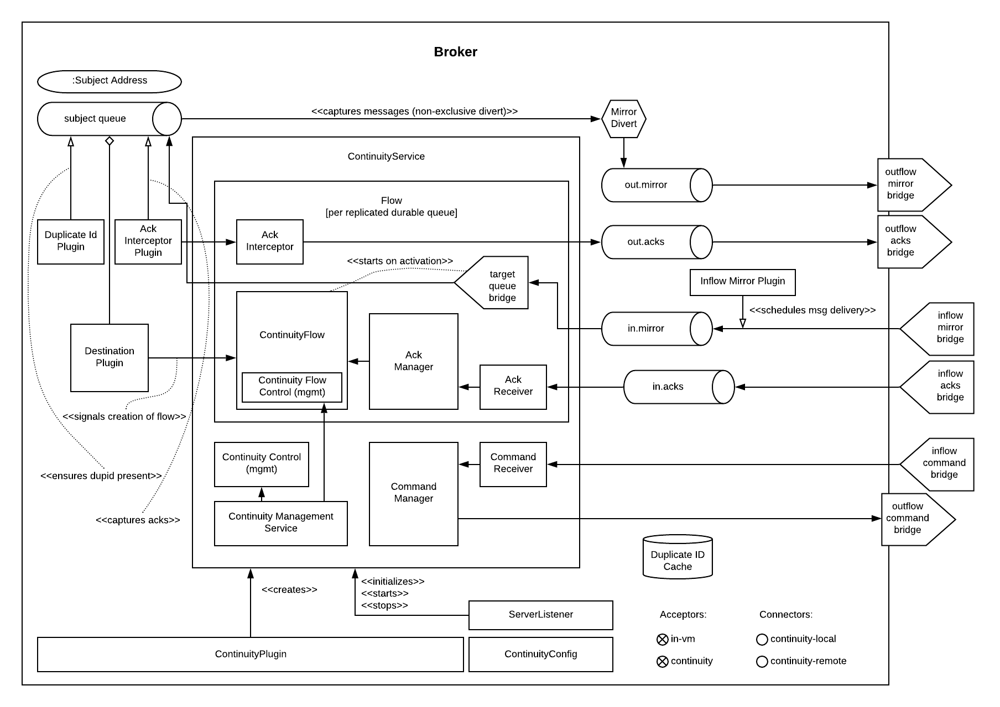

# Artemis Continuity Plugin v2

## Ontology

.*Core Service Components*
* ContinuityService
  - Manages the state of overall continuity service in the broker
  - Orchestrates the initialization and startup of the service
  - Handles the add/removal of destination flows
  - Owns identification of subject queues and addresses
  - Orchestrates site activation on swapover/failover within the broker
* ContinuityFlow
  - Handles creation of replication queues, bridges, diverts, etc for each subject queue
  - Handles activation of the flow to the target queue on swapover/failover to start delivery of messages 
* AckManager
  - Handles removal, scheduling, and duplicate id cache of messages on inflow messages and acks
* ContinuityConfig
  - Reads and parses settings from flat config properties
  - Defines continuity configuration defaults
  - Provides access to the configuration across service components 
  
.*Additional Service Components*
* CommandManager
  - Creation of command inflow and outflow destinations and bridges
  - Manages sessions for command producer and consumer
  - Delegates handling of the commands to the ContinuityService
* CommandReceiver
  - Message handler incoming commands
  - Delegates messages to the ContinuityService to orchestrate handling
* AckReceiver
  - Manages session for each ack inflow queue
  - Delegates ack handling to the appropriate AckManager for the flow
* AckInterceptor
  - Manages session to the outflow ack destination
  - Sends ack info on the outflow ack destination

.*Plugins*
* ContinuityPlugin
  - bootstraps the continuity service
  - registers dependent plugins
* DestinationPlugin
  - Signals the add and remove of queues and addresses
* InflowMirrorPlugin
  - Intercepts messages coming into remote site delegating to the AckManager for the appropriate flow
  - Updates by appropriate flow
* DuplicateIdPlugin
  - Ensures there is a duplicate ID on each incoming message on subject queues
* AckInterceptorPlugin
  - Captures acknowledgements to be sent to the remote site by appropriate flow
    
.*Domain Models*
* ContinuityCommand
   - Represents actions that used to control the site, and between sites to share configuration
* AckInfo
   - Represents acknowledgement details captured and passed to remote site 
* QueueInfo
   - Represents the subject queue configuration

## Current State

* Broker plugin that replicates broker configuration across two brokers
* Plugin config statically identifies destination address(s) to be replicated
* Only durabled non-temporary queues are setup for replication flows
* Test swapover and failover across across two brokers 

## TODO

x fix command send session issue 
x fix Ack and Command receive acknowledgment issue
x coordinate activation of site with deactivation
x add 'wait for ack consumption' for site activation
x block message produce/consume on deactivated site
x rationalize what happens when there are nondurable and temporary susbscribers
x add mbeans for observability of plugin components
x add additional queues to the same address both anycast and multicast
x add security configuration to allow more than static user/pass for intra-broker communication, plus continuity role/permissions

- test with master:slave cluster for each site

- create operator to deploy image and connect between two sites
- create Operator to orchestrate the broker swapover

- add measurement of estimated RTA/RPA and duplicate message risk
  - Outflow Message Loss Risk: outflow mirror depth
  - Outflow Duplicate Risk: outflow acks depth 
  - Outflow Recovery Point Actual: time of last bridged message - time it was acked by bridge
  - Inflow Recovery Point Actual: time of bridged message - time originally sent
  - Recovery Time Estimate: time to receive peer mirror and acks, plus time to remove messages based on acks
  
- load test 2 site single broker install (compare with single site without the plugin)

- implement queue / address removal

- load test 2 site single broker install (compare with single site without the plugin)
- soak test broker with continuity replication
- test model with shared nothing broker cluster in two sites
- add additional queue configuration synchronization (beyond initial queue/address pair it does now - filters, diverts, etc)
- deal with queue configuration updates (beyond the add it has today)

- allow for more than one remote site
- add discovery groups for remote site connectivity
- add finer tuning of continuity strategy
- create examples of swapover for local DC, and DC spanned clients, with swapover model
- automatically adjust delivery delay strategy timeframe based on detected RTO/RPO
- improve plugin failure / error handling, and shutdown cleanup
- improve documentation - add user level topology diagrams/docs, and detailed level contributor diagrams/docs
- create Continuity Plugin overview presentation
- evaluate adding synchronous replication model (custom divert that sends message and acks remotely, preventing delivery if 1 or more remotes are not available)

- analyze FSI apps and create IBM MQ eqivalent destinations
- extract MQ configuration from IBM WAS-ND and replicate in AMQ config
- convert info logging to AuditLogger pattern

- fix server stop issue (can't figure out how to hook into pre-server shutdown to stop sessions, bridges, etc)

- flow name 'address-queue' name in case queue name, in case queue not is not easily derived from address name, or if queue name is reused (although queue names must be unique, if reusing they will only be aligned with the first address)

## Risks

1. Clients by default batch message acknowledgement, which prevents the acks from being captured and forwarded to the remote site. This may improve client performance, but cause the window of ack replication to be large, and stress the remote broker as batches of acks are received. This can be aided by having smaller batch sizes or using transactional consumers which acknowledge each message received. 
2. Slow consumers may cause a build up of staged messages. As messages are acknowledged on the remote site the seek and removal time will be heavy for large staged queues. Using a message delivery delay and the duplicate id cache may be a good alternative. Load and soak testing is required to understand this risk better. 

