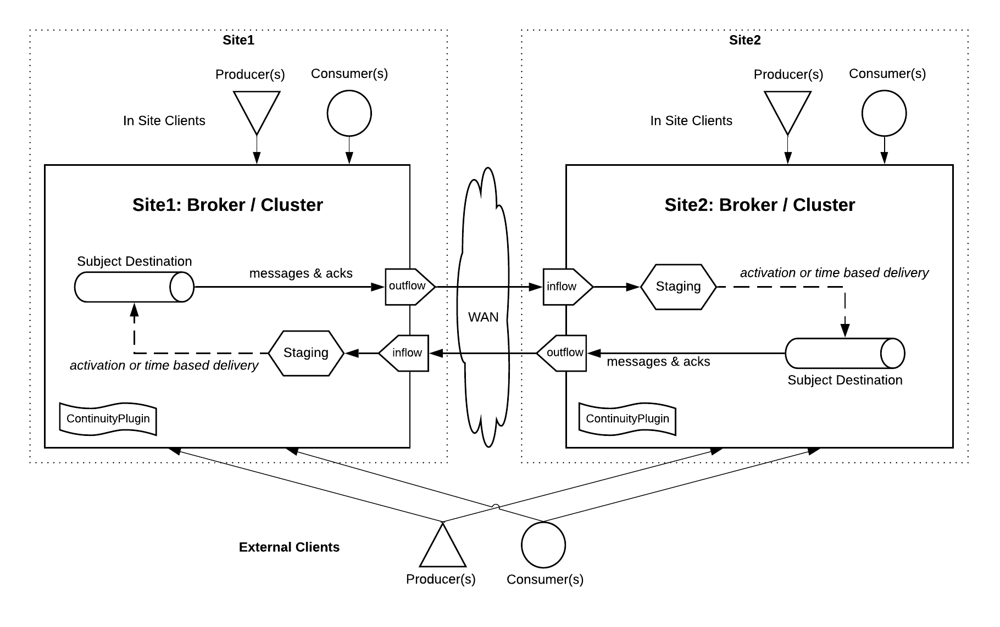

# Artemis Continuity Plugin

Provides a continuity model for the ActiveMQ Artemis Broker allowing multiple sites to asynchronously replicate to one another over a WAN. The intent is to provide simpler continuity of business / disaster recovery without overburdening the application with complexity. The plugin uses broker primitives of addresses, queues, message delivery scheduling, and duplicate id caches to keep the remote site ready for swapover.  

With a controlled swapover, the approach implemented by this plugin is capable of having zero message loss, and zero message duplication. With an abrupt failover of the main site, the approach minimizes message loss and duplication message consumption. 

The plugin reflects on the configured and dynamically created destinations in the broker to spin up the replication flows on startup or at runtime. This allows a simple static configuration to be added to a broker, while adding replicated destinations can be done with the typical configuration. 

A goal of the plugin will be to detect and measure the estimated RPO (Recovery Point Objective) and RTO (Recovery Time Objective) based on the message throughput, consumption speed, and client acknowledgement model. These metrics will then be surfaced to standardized monitoring tools to be compared against the required SLA for the application use case. 

## Intent 

The intent of this plugin is to give more options for cross-site resilience. Adding continuity at the broker isolates each broker's resilience to each broker installation, and depend less on the infrastructure / cloud provider. This will:

* allow application teams to 'shift left'
* reduce the dependency and goverance from the traditional bespoke infrastructure messaging teams
* reduce the cost of messaging since it runs on commodity infrastructure
* allow messaging brokers to be installed in isolation an an application component, instead of the traditionally heavily shared and managed installs
* and allow messaging to be used by more use cases

Adding continuity does have impact on performance. However, an overwhelming majority of messaging use cases will benefit from the resilience and reduced application complexity. When a use case requires traditional bespoke installation for maximized performance, you should go traditional. 

Traditional messaging heavily depends on the infrastructure and storage layer to provide replication. In a cloud / container environment, as the broker estate grows the pressure on the storage as a surface layer increases. Delegating resilience to a storage layer increases complexity and cost of operating the underlying cloud/infrastructure pattern and couples each messaging platform to a single point of failure. Many large firms have not yet added the three datacenter block storage quorum, and don't necessarily plan to. Many don't have three data centers. This plugin is intended to bypass this organizational challenge. 

## Design

As messages are sent, received, and acknowledged in one site, both the messages and acknowledgements are diverted to a remote site. The remote site stages the messages in an inflow destination where the the acknowledged messages are removed as inflow acknowledgements are recieved. 

It is installed and configured in an artemis broker as a plugin. The plugin configuration identifies the remote site, the target addresses to be replicated, necessary authentication details, and replication strategy. Brokers establish a command connection to transfer configuration at startup or as updates occur at runtime.

## Infrastructure Requirements

* Shared Nothing Broker Cluster Model
 1. Two relatively close data centers sites
 2. Local block storage with three availability zones
 3. OpenShift if installing with the container based approach

* Master:Slave Broker Cluster Model
 1.  Two relatively close data centers sites
 2. Replciated block storage (replicated across racks)
 3. OpenShift if installing with the container based approach

## Orchestration Process

Producers and Consumers can optionally already be started on the remote site no messages will be delivered to the target destinations until site is activated. 

.*Orchestrated Active:Passive Swapover*
1. Stop producers and consumers on site1
2. Wait mirror and ack outflow queues to be fully bridged to remote site
3. Signal activation of target remote site

.*Active:Passive Failover*
1. When it is detected that site1 is down
2. Signal activation of target remote site
3. Recover journals and restart site1 to bridge missing messages and acks to the remote site

.*Active:Active*
Both sites can be kept active, if using the staging delay configuration. They delay must be longer than the delta between the initial message produce, and acknowledgement recieve on the remote site side. This time delta average and maximum is measured by the plugin (and will be able to be monitored). It is highly recommended that the message consumers are strictly idempotent if his model is used.

